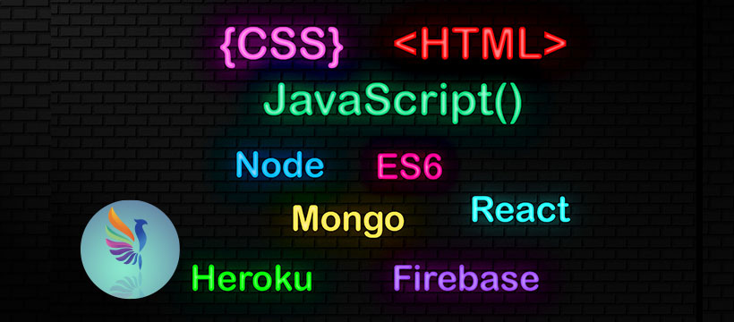

<!---
Majedul-Hasan/Majedul-Hasan is a ✨ special ✨ repository because its `README.md` (this file) appears on your GitHub profile.
You can click the Preview link to take a look at your changes.
--->

## Hi, I'm Majedul Hasan 

  👑 I am Web Developer  
  🖊️ Love to write code  
  🎤 Like to share my knowledge  
  🥅 2022 Goals: React, Node, Mongo, Next.js, Express.js

 

I am a Full Stack developer, experience with web applications and building websites, who is passionate about making error-free websites with 100% client satisfaction. I have professional experience working with React, MongoDB, Node, Express and JavaScript. I am undergraduate honours in Physics. In my time, I study new technologies. I am both driven and self-motivated.

## 👨‍💻 Skills & Experience:

  

  
  

  

  

  

  
    

  

  

  

  
  
  
  

  

  

  

  

 
 

##

## ☕ Connect with me!

 

## 📧 For Business Inquiries:

